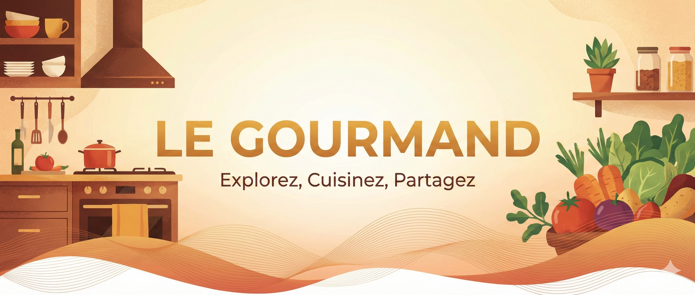

<p align="center">
  
</p>    
<div align="center">
    <p>
        <h2>📁Table of content</h2>
        <a href="#introduction">📖 Introduction</a> •
        <a href="#how-to-install">🚀 How to install</a> •
        <a href="#credits">🔗 Credits</a>
    </p>
</div>

---

<h2 id="introduction" align="center">📖 Introduction</h2>
**Le Gourmand** is an web application designed to help users to find recipes based on filters such as ingredients, dietary preferences, and cooking time. It provides a user-friendly interface to explore a wide variety of recipes, making it easier for users to discover new dishes and plan their meals.  
**Users** can olso login to save their favorite recipes.  

All data is stored into a database, and the application interacts with it using SQL queries and we use an API to fetch data from the database and display it on the front-end.


<br>
<details>
  <summary><b>About the origin of the content</b> (Click to expand)</summary>
  <br>
This project was created as part of a school assignment at Ynov Toulouse for BOOST dev module.
</details>

---

<h2 id="how-to-install" align="center">🚀 How to install?</h2>

1.  **Clone the repository** to your local machine using your terminal:
    ```bash
    git https://github.com/Joshua31400/le_gourmand.git
    ```
2.  **Navigate** to the project directory:
    ```bash
    cd la_gourmand
    ```
---

<h2 id="credits" align="center">🔗 Credits</h2>

<div align="center">
    <a href="https://github.com/joshua31400">
        
    </a>
    <a href="https://github.com/pmartins22">
        
    </a>
    <a href="https://github.com/tompass">
        
    </a>
    <a href="https://github.com/lucas-aww">
        
    </a>
    <br>
    <p><i>Adapté et développé par :</i></p>
    <p><i>Pedro MARTINS • Tom PASSERMAN • Lucas KOCHEIDA • Joshua BUDGEN</i></p>
<br>
        
Remerciments spéciaux à **<a href="https://www.ynov.com/campus/toulouse" target="_blank">Toulouse Ynov Campus</a>**
</div>

---

<div align="center">
    <p>Copyright © 2026. All Rights Reserved.</p>
</div>